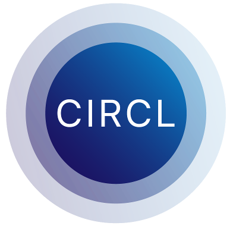

# CIRCL

[](https://GitHub.com/cloudflare/circl/releases/)
[](https://github.com/cloudflare/circl/actions)
[](https://pkg.go.dev/github.com/cloudflare/circl?tab=overview)
[](https://goreportcard.com/report/github.com/cloudflare/circl)
[](https://codecov.io/gh/cloudflare/circl)

**CIRCL** (Cloudflare Interoperable, Reusable Cryptographic Library) is a collection
of cryptographic primitives written in Go. The goal of this library is to be used as a tool for
experimental deployment of cryptographic algorithms targeting Post-Quantum (PQ) and Elliptic
Curve Cryptography (ECC).

## Security Disclaimer

🚨 This library is offered as-is, and without a guarantee. Therefore, it is expected that changes in the code, repository, and API occur in the future. We recommend to take caution before using this library in a production application since part of its content is experimental. All security issues must be reported, please notify us immediately following the instructions given in our [Security Policy](https://github.com/cloudflare/circl/security/policy).

## Installation

You can get CIRCL by fetching:

```sh
go get -u github.com/cloudflare/circl
```

## List of Algorithms

#### Diffie-Hellman Protocol
- [X25519](https://datatracker.ietf.org/doc/html/rfc7748/)
- [X448](https://datatracker.ietf.org/doc/html/rfc7748/)
- [Curve4Q](https://datatracker.ietf.org/doc/draft-ladd-cfrg-4q/)

#### Digital Signature Schemes
- [Ed25519](https://datatracker.ietf.org/doc/rfc8032/)
- [Ed448](https://datatracker.ietf.org/doc/rfc8032/)

#### Groups based on Elliptic Curves
 - P-256, P-384, P-521, [FIPS 186-4](https://doi.org/10.6028/NIST.FIPS.186-4)
 - [Ristretto](https://datatracker.ietf.org/doc/draft-irtf-cfrg-ristretto255-decaf448/01/)
 - [Hash to Curve](https://datatracker.ietf.org/doc/draft-irtf-cfrg-hash-to-curve/)

#### High-Level Protocols
 - [HPKE](https://datatracker.ietf.org/doc/draft-irtf-cfrg-hpke/): Hybrid Public-Key Encryption
 - [VOPRF](https://datatracker.ietf.org/doc/draft-irtf-cfrg-voprf/): Verifiable Oblivious Pseudorandom function: OPRF, VOPRF and POPRF modes.
 - [BlindRSA](https://datatracker.ietf.org/doc/draft-irtf-cfrg-rsa-blind-signatures/): Blind RSA signatures.
 - [CPABE](./abe/cpabe): Ciphertext-policy Attribute-based Encryption.

#### Post-Quantum Key Encapsulation Methods
 - [CSIDH](https://csidh.isogeny.org/): Post-Quantum Commutative Group Action
 - [Kyber](https://pq-crystals.org/kyber/) KEM: modes 512, 768, 1024
 - [FrodoKEM](https://frodokem.org/) KEM: modes 640-SHAKE
 - (**insecure, deprecated**) [SIDH/SIKE](https://sike.org/): Supersingular Key Encapsulation with primes p434, p503, p751

#### Post-Quantum Public-Key Encryption
 - [Kyber](https://pq-crystals.org/kyber/) PKE: modes 512, 768, 1024

#### Post-Quantum Digital Signature Schemes
 - [Dilithium](https://pq-crystals.org/dilithium/): modes 2, 3, 5

#### Field Arithmetic
 - Fp25519, Fp448, Fp381

#### Elliptic Curves
 - P-384 Curve
 - [FourQ](https://eprint.iacr.org/2015/565)
 - [Goldilocks](https://eprint.iacr.org/2015/625)
 - [BLS12-381](https://electriccoin.co/blog/new-snark-curve/): Bilinear pairings, hash to G1 and G2.

#### Parallel SIMD
 - [Keccak](https://keccak.team/keccak_specs_summary.html) f1600 Permutation

#### XOF: eXtendable Output Functions
 - [FIPS 202](https://doi.org/10.6028/NIST.FIPS.202): SHAKE128 and SHAKE256
 - [BLAKE2X](https://www.blake2.net/blake2x.pdf): BLAKE2XB and BLAKE2XS

#### Zero-knowledge Proofs
 - [Schnorr](./zk/dl): Prove knowledge of the Discrete Logarithm.
 - [DLEQ](./zk/dleq): Prove knowledge of the Discrete Logarithm Equality.

## Testing and Benchmarking

Library comes with number of make targets which can be used for testing and
benchmarking:

- ``test`` performs testing of the binary.
- ``bench`` runs benchmarks.
- ``cover`` produces coverage.
- ``lint`` runs set of linters on the code base.

## Contributing

To contribute, fork this repository and make your changes, and then make a Pull
Request. A Pull Request requires approval of the admin team and a successful
CI build.

## How to Cite

To cite CIRCL, use one of the following formats and update the version and date you accessed this project.

APA Style

```
Faz-Hernández, A. and Kwiatkowski, K. (2019). Introducing CIRCL:
An Advanced Cryptographic Library. Cloudflare. Available at
https://github.com/cloudflare/circl. v1.3.3 Accessed May, 2023.
```

Bibtex Source

```bibtex
@manual{circl,
  title        = {Introducing CIRCL: An Advanced Cryptographic Library},
  author       = {Armando Faz-Hern\'{a}ndez and Kris Kwiatkowski},
  organization = {Cloudflare},
  abstract     = {{CIRCL (Cloudflare Interoperable, Reusable Cryptographic Library) is
                   a collection of cryptographic primitives written in Go. The goal
                   of this library is to be used as a tool for experimental
                   deployment of cryptographic algorithms targeting Post-Quantum (PQ)
                   and Elliptic Curve Cryptography (ECC).}},
  note         = {Available at \url{https://github.com/cloudflare/circl}. v1.3.3 Accessed May, 2023},
  month        = jun,
  year         = {2019}
}
```

CFF Style

See attached [CITATION.cff](CITATION.cff) file.

## License

The project is licensed under the [BSD-3-Clause License](./LICENSE).
